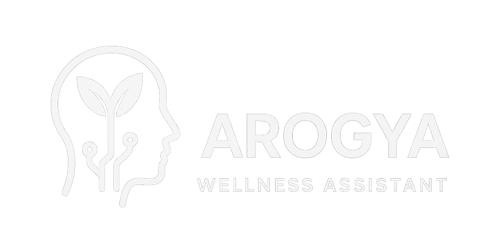
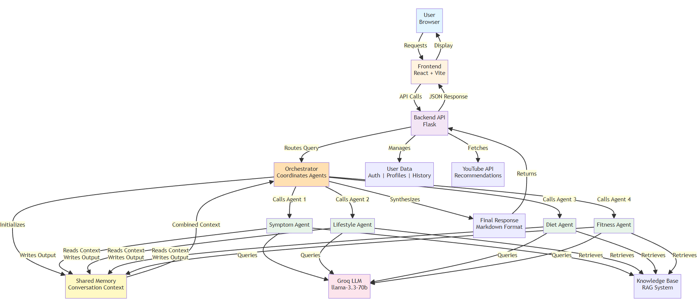

# Arogya Wellness Assistant
A multi-agent orchestration framework built using **LangChain** that coordinates specialized agents to analyze user symptoms and deliver personalized wellness guidance across diet, fitness, and lifestyle.

<div align="center">
  
</div>

## About

Arogya Wellness Assistant is an AI-powered health consultation platform that provides personalized wellness guidance through intelligent conversation. Built with **LangChain's multi-agent framework**, it orchestrates specialized agents to deliver comprehensive advice across diet, fitness, lifestyle, and symptom analysis.

The application is a full-stack health and wellness platform that provides AI-powered health guidance, personalized recommendations, and user profile management. The project is built with a Flask backend and a React (Vite) frontend, designed with a clear separation of concerns and a modular, extensible architecture.

---

## Key Features

The application allows users to:

- Interact with an AI-based health assistant powered by multi-agent orchestration
- Maintain and update personal health profiles with detailed medical information
- View past health conversations and consultation history
- Receive relevant YouTube-based educational health recommendations
- Get personalized wellness guidance across multiple domains (diet, fitness, lifestyle, symptom analysis)

The system emphasizes clarity, simplicity, and structured AI-driven workflows with a safety-first approach to health guidance.

---

## System Architecture Flow

<div align="center">
  
</div>

### Agent Communication Workflow

1. **User Interaction**: User submits health query through React frontend
2. **Request Processing**: Frontend sends request to Flask backend API
3. **Orchestration**: Orchestrator initializes shared memory and coordinates all agents
4. **Sequential Agent Execution**:
   - **Symptom Agent** analyzes symptoms, queries LLM and knowledge base, writes to shared memory
   - **Lifestyle Agent** reads previous context from memory, adds lifestyle advice, updates memory
   - **Diet Agent** reads accumulated context, provides nutrition guidance, updates memory
   - **Fitness Agent** reads all prior context, recommends exercises, updates memory
5. **Context Sharing**: Each agent sees outputs from previous agents through shared memory
6. **LLM Integration**: All agents query the same Groq LLM with their specialized prompts
7. **Knowledge Enhancement**: Agents retrieve relevant context from RAG knowledge base
8. **Synthesis**: Orchestrator combines all agent outputs into comprehensive markdown response
9. **Response Delivery**: Final result returned to frontend for display

---

```
arogya-wellness-assistant/
├── assets/                            # Project documentation assets
│   ├── arogya-logo.png                # Application logo
│   └── architecture-flow.png          # System architecture diagram
│
├── backend/                           # Flask REST API Backend
│   ├── __init__.py
│   ├── app.py                         # Flask application & endpoints
│   ├── wsgi.py                        # Production WSGI configuration
│   ├── config/                        # Configuration management
│   │   ├── __init__.py
│   │   ├── settings.py                # Environment & API configuration
│   │   └── logging.py                 # Logging setup
│   ├── services/                      # Core business logic
│   │   ├── __init__.py
│   │   ├── agents.py                  # Multi-agent AI system (symptom, lifestyle, diet, fitness)
│   │   ├── orchestrator.py            # Agent orchestration & coordination
│   │   ├── memory.py                  # Conversation memory management
│   │   ├── rag.py                     # Retrieval-Augmented Generation (knowledge base)
│   │   ├── api_key_pool.py            # API key management & quota handling
│   │   ├── history_store.py           # Conversation history persistence
│   │   ├── user_auth_store.py         # User authentication & credentials
│   │   ├── user_profile_store.py      # User health profile management
│   │   └── youtube_recommendations.py # YouTube content integration
│   ├── utils/                         # Utility functions
│   │   ├── __init__.py
│   │   └── exceptions.py              # Custom exception classes
│   ├── storage/                       # JSON data storage
│   │   ├── users.json                 # User credentials
│   │   ├── user_profiles.json         # User health profiles
│   │   ├── history.json               # Conversation history
│   │   └── knowledge.json             # Knowledge base for RAG
│   └── BACKEND_README.md              # Detailed backend documentation
│
├── frontend/                          # React + Vite Frontend
│   ├── src/                           # Source code
│   │   ├── main.jsx                   # React entry point
│   │   ├── App.jsx                    # Main application component
│   │   ├── App.css                    # Global styles
│   │   ├── index.css                  # Base styles
│   │   ├── config.js                  # Frontend configuration
│   │   ├── assets/                    # Static assets (images, icons)
│   │   ├── components/                # Reusable React components
│   │   │   ├── HomePage.jsx           # Landing page
│   │   │   ├── LoginPage.jsx          # User authentication
│   │   │   ├── WellnessPage.jsx       # Main AI consultation interface
│   │   │   ├── HistoryPage.jsx        # Conversation history viewer
│   │   │   ├── ProfilePage.jsx        # User profile management
│   │   │   ├── YouTubeRecommendations.jsx # Educational content
│   │   │   └── NavBar.jsx             # Navigation component
│   │   └── styles/                    # Component-specific styles
│   │       └── YouTubeRecommendations.css
│   ├── public/                        # Public static files
│   ├── index.html                     # HTML entry point
│   ├── package.json                   # Node.js dependencies
│   ├── vite.config.js                 # Vite build configuration
│   ├── tailwind.config.js             # Tailwind CSS configuration
│   ├── eslint.config.js               # ESLint rules
│   └── FRONTEND_README.md             # Detailed frontend documentation
│
├── website-preview/                   # Application screenshots and UI previews
│
├── README.md                          # Project root documentation
├── LICENSE.txt                        # License information
├── requirements.txt                   # Root Python dependencies
└── .env                               # Environment variables (not in repo)
```

### Directory Descriptions

**Backend** (`/backend`)

- Complete REST API implementation using Flask
- Multi-agent AI orchestration system powered by LangChain
- User authentication, profile management, and conversation history
- Knowledge base and RAG system for enhanced responses
- API key pooling for managing multiple Groq API keys

**Frontend** (`/frontend`)

- React single-page application with Vite bundler
- Responsive UI with Tailwind CSS
- Six main components for authentication, consultation, profiles, and history
- Real-time communication with backend API
- Educational content integration with YouTube

---

## Prerequisites

Before running the project, ensure the following are installed:

- Python 3.8 or higher
- Node.js 16 or higher
- pip (Python package manager)
- npm (Node.js package manager)
- Git

---

## Quick Start (Run Locally)

This section is for anyone cloning the repository for the first time.

### Step 1: Clone the Repository

```bash
git clone https://github.com/venkata-arjun/arogya-wellness-assistant.git
cd arogya-wellness-assistant
```

Ensure you are inside the project root directory.

---

### Step 2: Backend Setup (Flask)

1. Create a Python virtual environment:

```bash
python -m venv venv
```

2. Activate the virtual environment:

```bash
venv\Scripts\activate        # Windows
source venv/bin/activate     # macOS / Linux
```

3. Install backend dependencies:

```bash
pip install -r requirements.txt
```

4. Create a `.env` file inside the `backend/` directory and add:

```
GROQ_API_KEY=your_groq_api_key
GROQ_MODEL_NAME=llama-3.3-70b-versatile
YOUTUBE_API_KEY=your_youtube_api_key
```

5. Start the backend server:

```bash
python -m backend.app
```

If successful, the backend will run at:

```
http://127.0.0.1:5000
```

Keep this terminal running.

---

### Step 3: Frontend Setup (React + Vite)

1. Open a new terminal.
2. Navigate to the frontend directory:

```bash
cd frontend
```

3. Install frontend dependencies:

```bash
npm install
```

4. Start the frontend development server:

```bash
npm run dev
```

The frontend will be available at:

```
http://localhost:5173
```

---

### Step 4: Use the Application

- Open `http://localhost:5173` in your browser
- Register or log in
- Enter health-related queries
- View AI-generated guidance and recommendations

---

## Key Features

- User authentication and profile management
- AI-powered health assistance using Groq models
- Persistent health profiles
- Conversation history tracking
- Context-aware YouTube video recommendations
- Lightweight JSON-based data storage
- Modular, service-oriented backend design

---

## API Endpoints

### Authentication

- `POST /login`
  Authenticates a user.

- `POST /register`
  Registers a new user.

### User Profile

- `GET /profile/<username>`
  Retrieves a user profile.

- `POST /profile/<username>`
  Updates a user profile.

### Health Assistance and Chat

- `POST /chat_stream`
  Streams AI-generated responses.

- `POST /health-assist`
  Returns structured health guidance.

- `GET /history/<username>`
  Retrieves user chat history.

### Recommendations

- `POST /youtube-recommendations`
  Returns health-related YouTube video suggestions.

---

## Environment and API Keys

The application depends on external APIs:

- Groq API for AI model responses
- YouTube Data API for video recommendations

Ensure API keys are:

- Added only to the `.env` file
- Never committed to version control

---

## Troubleshooting

### Backend Issues

**ModuleNotFoundError: No module named `backend`**

- Run commands from the project root
- Confirm dependencies are installed

**HTTP 429 (Rate Limit Exceeded)**

- Groq API quota has been exceeded
- Retry after some time or add additional API keys

**Backend Not Starting**

- Ensure port 5000 is free
- Verify virtual environment is activated

---

### Frontend Issues

**Missing Dependencies**

- Delete `node_modules/` and `package-lock.json`
- Run `npm install` again

**Port Already in Use**

- Vite will automatically select another port
- Or stop the conflicting process

---

## Development Notes

- Backend is built using Flask with async support
- LangChain is used for LLM orchestration and agent interaction
- Frontend uses React with Vite for fast builds and hot reload
- Data storage is intentionally simple for clarity and ease of debugging

---

## Git and Version Control

Ensure the following are listed in `.gitignore`:

- `venv/`
- `node_modules/`
- `.env`
- `__pycache__/`

This prevents sensitive data and unnecessary files from being committed.

---

## Support and Debugging

For issues:

- Check backend terminal logs
- Review stack traces carefully
- Validate environment variables and API keys

